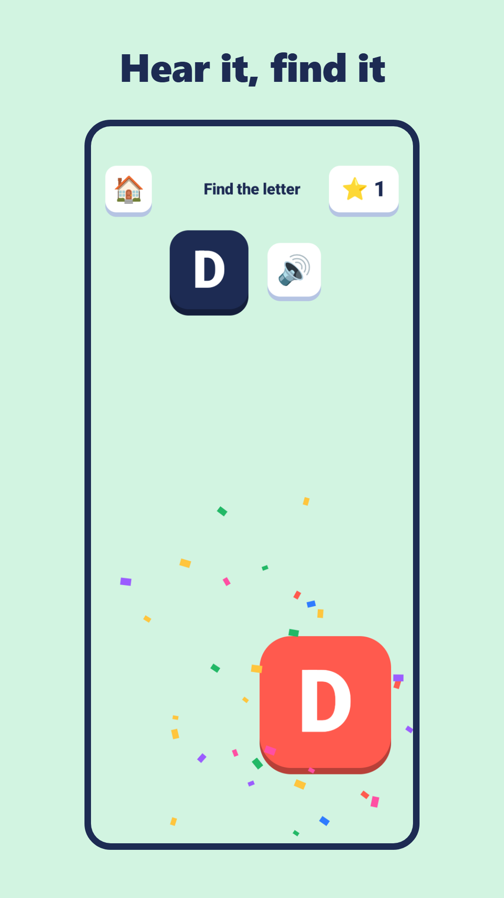
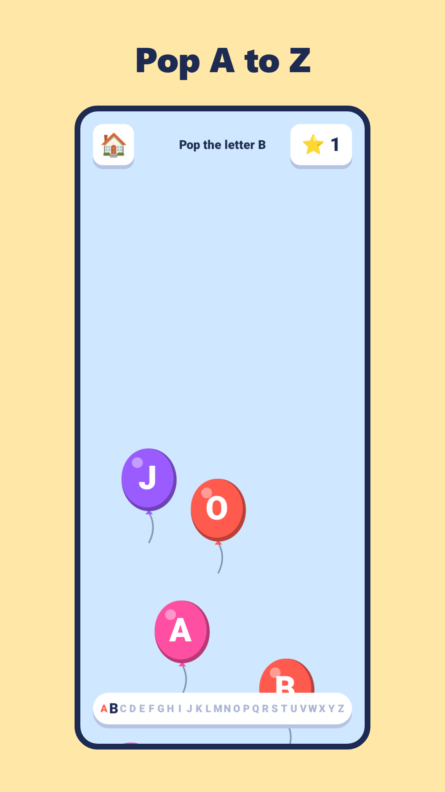
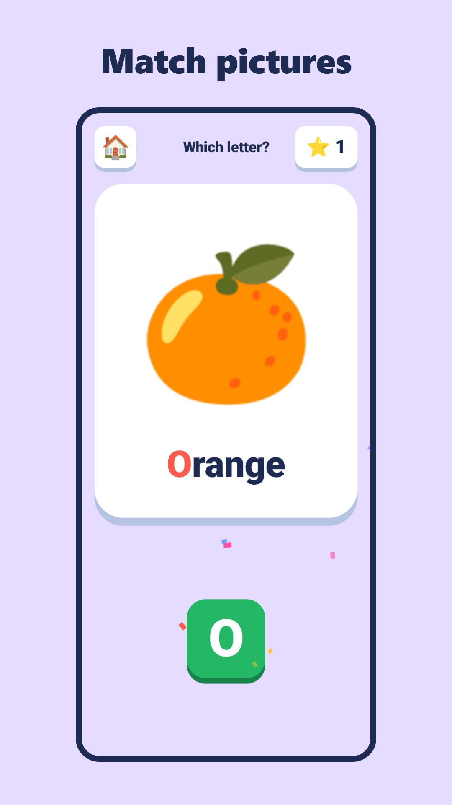

<p align="center">
  
</p>

<h1 align="center">Akshar Blocks</h1>

<p align="center">
  An offline Android learning app that teaches children aged 3–7 <b>English ABC</b>, <b>Hindi letters</b> (स्वर, व्यंजन, बारहखड़ी) and <b>numbers</b> through play.
</p>

<p align="center">
  
  
  
  
</p>

---

## Screenshots

<p align="center">
  
  
  
</p>

## Features

**Seven learning tracks**

| Track | What the child learns |
|---|---|
| English ABC | Capital letters A–Z with a picture for each (A for Apple) |
| Small letters | a–z, matched to their capitals |
| स्वर (Swar) | Hindi vowels अ – अः |
| व्यंजन (Vyanjan) | Hindi consonants क – ज्ञ |
| बारहखड़ी (Barakhadi) | Consonant + vowel sign (क का कि की …) |
| Numbers | 1–100, with counting games |
| गिनती (Ginti) | Hindi numerals १–१०० |

**Nine game modes**: Learn, Trace (follow the strokes with a finger), Find it, Balloon pop, Match the picture, Memory pairs, First words (build c-a-t or ज-ल from letter blocks), Count, and Build a syllable (बारहखड़ी).

**Voice in English and Hindi.** Every instruction and letter name is spoken. 1,100+ pre-recorded clips ship with the app, and text-to-speech covers anything else, so it works with no internet.

**Learns with the child.** Adaptive practice brings back letters a child gets wrong, and tracks which letters get mixed up (b ↔ d, ब ↔ व).

**Rewards.** Stars, a sticker album (a new sticker every 5 stars) and a daily streak.

**Parent area**, behind a typed maths question so children can't open it:
- Up to 4 child profiles, each with their own progress.
- A daily play-time limit (15–60 minutes), with a friendly "time to rest" screen.
- A **report card** for each child: level per track, a colour-coded letter map, a weekly play-time chart, letters that need practice, and a Share button.

**Private by design.** No ads, no accounts, no internet permission, no analytics. All progress stays on the device and backups are turned off. The app follows Google Play's Families policy.

**Phones and tablets**, in portrait and landscape.

## Tech stack

| | |
|---|---|
| Language | Kotlin |
| Platform | Android SDK (min API 24, target API 37), Android Gradle Plugin 9 |
| UI | Custom `Canvas` game engine (`GameView`) with animation, plus Material Components for the parent area |
| Audio | `MediaPlayer` for bundled voice clips, Android `TextToSpeech` as fallback, `AudioTrack` for sound effects generated in code |
| Content | Plain TSV files for letters, tracing strokes and words, so new content needs no code changes |
| Art | [Noto Emoji](https://github.com/googlefonts/noto-emoji) images (Apache 2.0), bundled for consistent look on every device |
| Testing | JUnit: 71 unit tests covering content, tracing, rewards, reports, play-time limits and voice clips |
| Tools | Android Studio, Gradle, Claude Code (AI-assisted development) |

## Project structure

```
app/src/main/
├── java/com/aksharblocks/app/
│   ├── MainActivity.kt        # Screen navigation (home, tracks, games, rest)
│   ├── GameView.kt            # Base game engine: drawing, animation, taps
│   ├── LearnView.kt, TraceView.kt, FindView.kt, BalloonView.kt,
│   │   MatchView.kt, MemoryView.kt, WordsView.kt, CountView.kt,
│   │   BarakhadiView.kt       # One class per game mode
│   ├── Alphabet.kt, Lang.kt   # Tracks, letters, and English/Hindi phrases
│   ├── Voice.kt, Speaker.kt   # Bundled voice clips with TTS fallback
│   ├── Profiles.kt, Rewards.kt, PlayTime.kt
│   ├── ParentActivity.kt, ParentGate.kt, ReportCard.kt
│   └── ...
└── assets/
    ├── tracks/     # Letters and pictures for each track (TSV)
    ├── tracing/    # Stroke paths for tracing (TSV)
    ├── words/      # Word lists for "First words" (TSV)
    ├── art/        # Noto Emoji images
    └── voice/      # English and Hindi voice clips (.m4a)
```

## Build and run

Requirements: Android Studio (latest), JDK 17+, an Android device or emulator on Android 7.0+.

```bash
git clone https://github.com/abhishekjahazi/akshar-blocks.git
cd akshar-blocks

./gradlew installDebug        # build and install on a connected device
./gradlew testDebugUnitTest   # run the unit tests
```

Release builds need a signing key in `keystore.properties`, which is not part of this repository.

## Status

Version 1.0, being prepared for release on Google Play.

## Credits

- Emoji art: [Noto Emoji](https://github.com/googlefonts/noto-emoji) by Google, Apache License 2.0 (see `app/src/main/assets/art/LICENSE-noto-emoji.txt`).
- Voices: generated with Google's on-device text-to-speech voices.

---

<p align="center">Made by <a href="https://github.com/abhishekjahazi">Abhisek Jahaji</a></p>
