| Fruits & veggies | 18 fruits and vegetables (Mango – आम, Carrot – गाजर) |
| My body | 12 parts of the body (Nose – नाक, Hand – हाथ) |
| Family | Mother – माँ, Grandfather – दादा, Baby – बच्चा… |

The picture tracks (colors, shapes, animals, fruits, body, family) live together in one **World** corner on Home.<p align="center">
  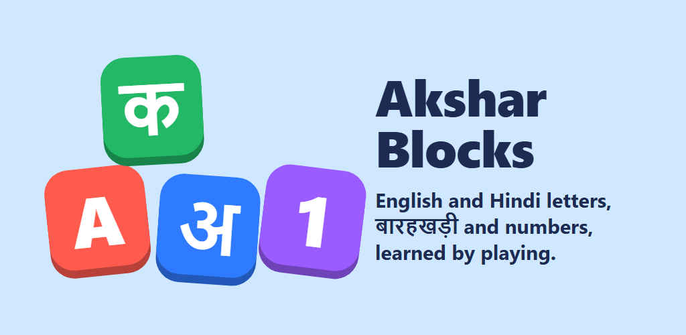
</p>

<h1 align="center">Akshar Blocks</h1>

<p align="center">
  An offline Android learning app that teaches children aged 3–7 <b>English ABC</b>, <b>Hindi letters</b> (स्वर, व्यंजन, बारहखड़ी) and <b>numbers</b> through play.
</p>

<p align="center">
  
  
  
  <a href="https://github.com/abhishekjahazi/akshar-blocks/actions/workflows/tests.yml"></a>
  
</p>

<p align="center">
  <a href="https://github.com/abhishekjahazi/akshar-blocks/releases/latest"><b>⬇️ Download the app (APK)</b></a>
</p>

---

## Screenshots

| Home: 13 sections | Game modes for a track | Tracing with stroke order |
|:---:|:---:|:---:|
| 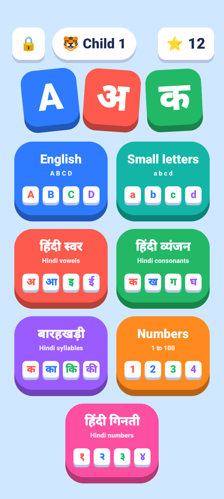 | 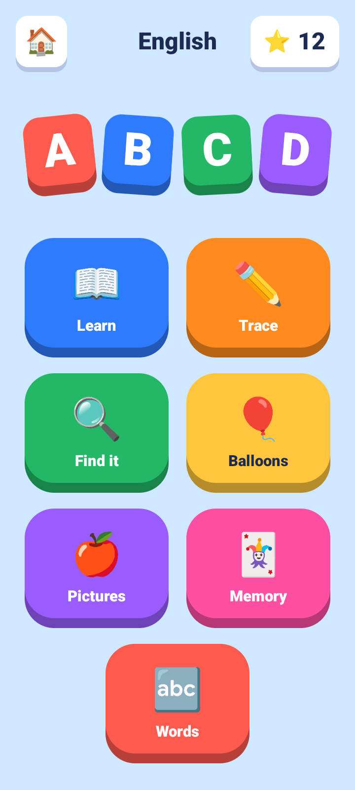 | 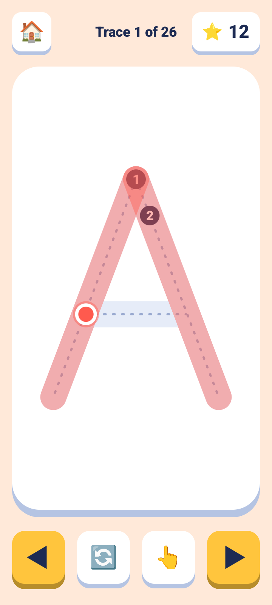 |
| **First words: build s-u-n** | **Memory: find the pairs** | **बारहखड़ी: add the vowel sign** |
| 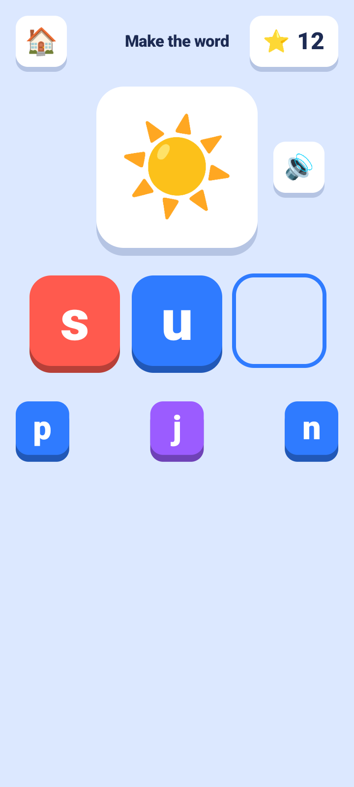 | 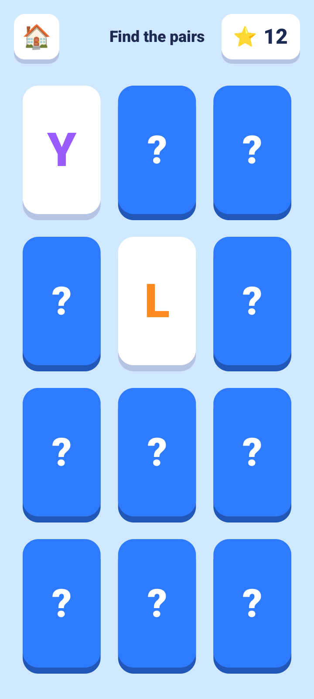 | 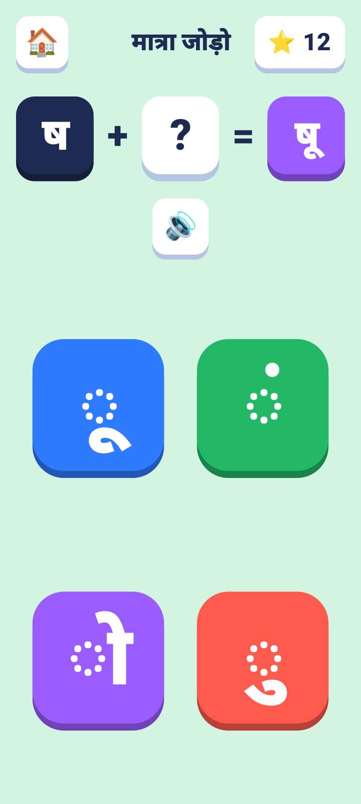 |
| **Today's games: a daily path** | **Report card for parents** | **Daily play-time limit** |
| 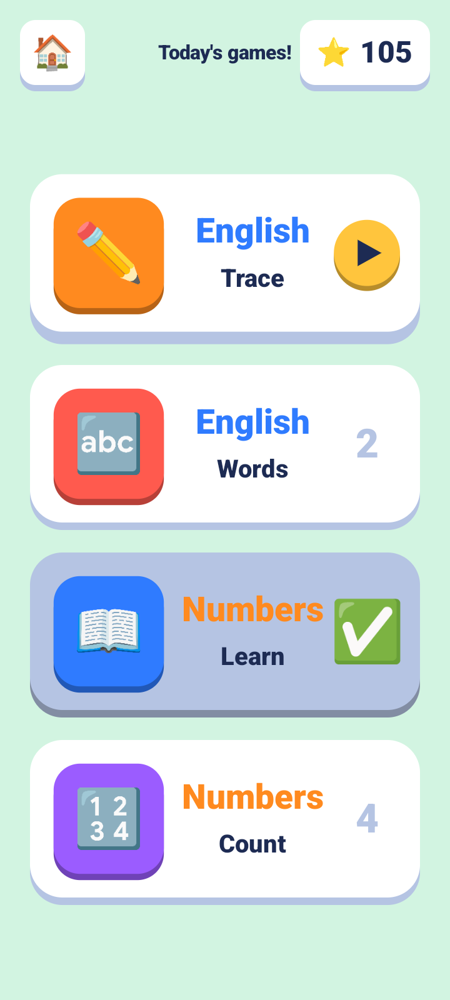 | 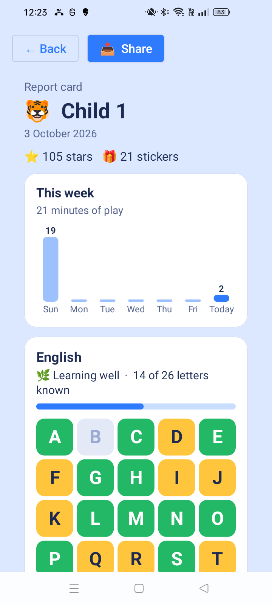 | 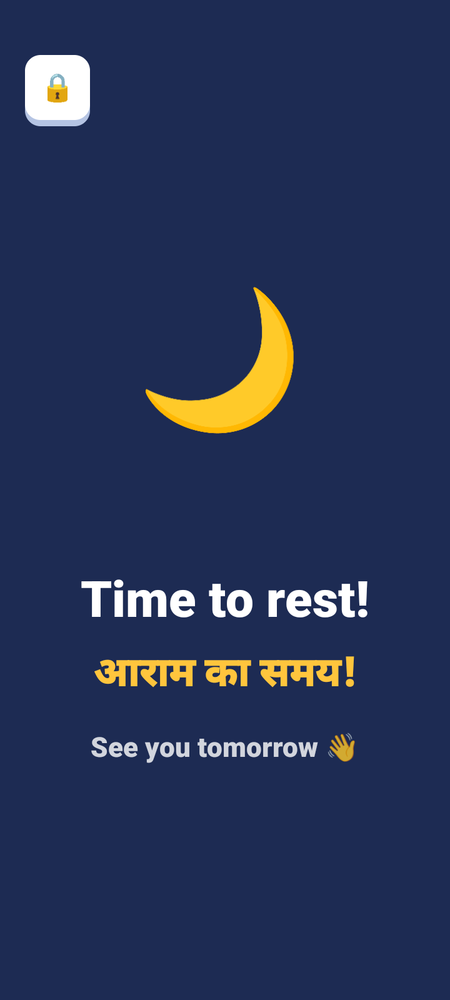 |
| **Animals in English and Hindi** | **Rhymes, line by line** | **Write my own name** |
| 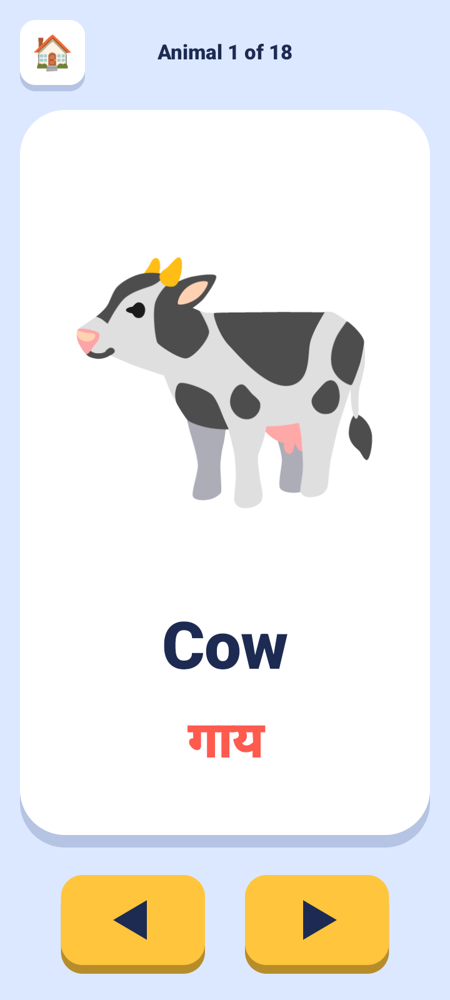 | 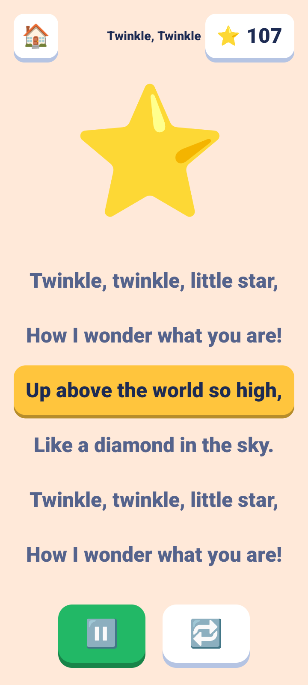 | 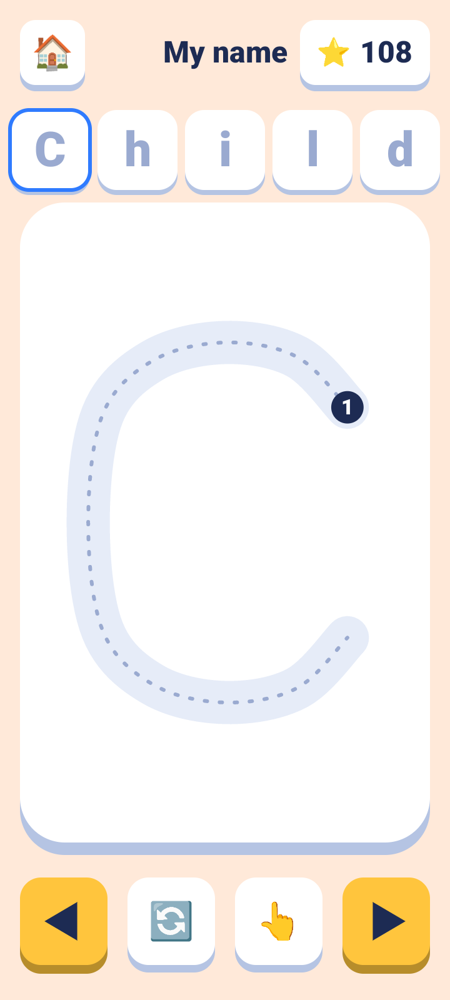 |

## Features

**Fourteen learning tracks**

| Track | What the child learns |
|---|---|
| English ABC | Capital letters A–Z with a picture for each (A for Apple) |
| Small letters | a–z, matched to their capitals |
| स्वर (Swar) | Hindi vowels अ – अः |
| व्यंजन (Vyanjan) | Hindi consonants क – ज्ञ |
| बारहखड़ी (Barakhadi) | Consonant + vowel sign (क का कि की …) |
| Numbers | 1–100, with counting games |
| गिनती (Ginti) | Hindi numerals १–१०० |
| मराठी (Marathi) | 49 Marathi letters with Marathi words (अ – अननस), in a Marathi voice |
| Colors | 9 colors, named in English and Hindi (Red – लाल) |
| Shapes | 7 shapes (Circle – गोला, Triangle – त्रिकोण…) |
| Animals | 18 animals and the sounds they make (Cow – गाय – "moo") |

**Ten game modes**: Learn, Trace (follow the strokes with a finger), Find it, Balloon pop, Match the picture, Memory pairs, First words (build c-a-t, ज-ल, or with matras कि-ता-ब), Count, Build a syllable (बारहखड़ी), and Sounds ("Who says moo?" for animals, "Which letter says buh?" for English phonics).

**Maths with pictures.** Add (🍎🍎 + 🍎 = ?), take away (things get crossed out), tap the side with more or fewer, and finish a pattern (🔴🔵🔴 → ?). Every question is spoken in English and then in Hindi ("3 and 2 make 5! तीन और दो, पाँच!").

**Phonics.** Every English letter has its sound as well as its name: "B is for Ball. B says buh!"

**Voice in English, Hindi and Marathi.** Every instruction and letter name is spoken. 1,800+ pre-recorded clips ship with the app, and text-to-speech covers anything else, so it works with no internet.

**Today's games.** One big button on Home starts a short daily path of four games picked from the child's progress: Learn while letters are new, then Trace, plus a practice game that changes every day. English, Hindi and numbers take turns, and the next section opens once the first is half learned.

**Learns with the child.** Adaptive practice brings back letters a child gets wrong, and tracks which letters get mixed up (b ↔ d, ब ↔ व).

**Rewards.** Stars, a sticker album (a new sticker every 5 stars) and a daily streak. Stars also buy dress-up things in the **reward shop** (a bow, glasses, a top hat, a crown…) for the child's animal, which then wears them on Home. No real money, ever. Learning most of a section earns a **certificate** with the child's name, which parents can share.

**Rhymes.** 12 rhymes: traditional English, Hindi and Marathi ones and two written for the app, read line by line with the current line lit up.

**My name.** Children trace their own name, letter by letter (A a r a v, or रि या).

**Soft background music**, a music-box tune made in code that gets quieter whenever the voice speaks.

**Parent area**, behind a typed maths question so children can't open it:
- Up to 4 child profiles, each with their own progress.
- A daily play-time limit (15–60 minutes), with a friendly "time to rest" screen.
- A **report card** for each child: level per track, a colour-coded letter map, a weekly play-time chart, letters that need practice, and a Share button.
- Certificates to share, and switches for game sounds and music.
- Save a backup file of the children and their progress, and restore it on a new phone.
- **Printable worksheets**: tracing sheets for A–Z, a–z, स्वर, व्यंजन, 1–20 and १–२०, printed or saved as a PDF.

**Private by design.** No accounts and no analytics; all progress stays on the device and backups are turned off. The only ad is a small banner on the home screen (Google AdMob), requested as child-directed with "G"-rated, non-personalized ads and no advertising ID: nothing appears inside the games. The app follows Google Play's Families policy.

**Phones and tablets**, in portrait and landscape.

## Tech stack

| | |
|---|---|
| Language | Kotlin |
| Platform | Android SDK (min API 24, target API 37), Android Gradle Plugin 9 |
| UI | Custom `Canvas` game engine (`GameView`) with animation, plus Material Components for the parent area |
| Audio | `MediaPlayer` for bundled voice clips, Android `TextToSpeech` as fallback, `AudioTrack` for sound effects and background music generated in code |
| Content | Plain TSV files for letters, tracing strokes and words, so new content needs no code changes |
| Art | [Noto Emoji](https://github.com/googlefonts/noto-emoji) images (Apache 2.0), bundled for consistent look on every device |
| Ads | Google Mobile Ads SDK (AdMob): one banner on Home, child-directed, max rating G, advertising ID and ad-services permissions removed; debug builds use Google's test ads |
| Testing | JUnit: 109 unit tests (content, tracing, maths, the reward shop, worksheets, rewards, reports, the daily path, rhymes, names, phonics, certificates, backups, music, play-time limits, voice clips). CI also builds the release version and plays it on an emulator with 600 random taps |
| Tools | Android Studio, Gradle, Claude Code (AI-assisted development) |

## Project structure

```
app/src/main/
├── java/com/aksharblocks/app/
│   ├── MainActivity.kt        # Screen navigation (home, tracks, games, rest)
│   ├── GameView.kt            # Base game engine: drawing, animation, taps
│   ├── LearnView.kt, TraceView.kt, FindView.kt, BalloonView.kt,
│   │   MatchView.kt, MemoryView.kt, WordsView.kt, CountView.kt,
│   │   BarakhadiView.kt       # One class per game mode
│   ├── Alphabet.kt, Lang.kt   # Tracks, letters, and English/Hindi phrases
│   ├── Voice.kt, Speaker.kt   # Bundled voice clips with TTS fallback
│   ├── Profiles.kt, Rewards.kt, PlayTime.kt
│   ├── ParentActivity.kt, ParentGate.kt, ReportCard.kt
│   └── ...
└── assets/
    ├── tracks/     # Letters and pictures for each track (TSV)
    ├── tracing/    # Stroke paths for tracing (TSV)
    ├── words/      # Word lists for "First words" (TSV)
    ├── art/        # Noto Emoji images
    └── voice/      # English and Hindi voice clips (.m4a)
```

## Build and run

Requirements: Android Studio (latest), JDK 17+, an Android device or emulator on Android 7.0+.

```bash
git clone https://github.com/abhishekjahazi/akshar-blocks.git
cd akshar-blocks

./gradlew installDebug        # build and install on a connected device
./gradlew testDebugUnitTest   # run the unit tests
```

Release builds need a signing key in `keystore.properties`, which is not part of this repository.

## Status

Version 1.0 is out: download the APK from [Releases](https://github.com/abhishekjahazi/akshar-blocks/releases/latest) (Android 7.0+). A Google Play release is planned.

## Credits

- Emoji art: [Noto Emoji](https://github.com/googlefonts/noto-emoji) by Google, Apache License 2.0 (see `app/src/main/assets/art/LICENSE-noto-emoji.txt`).
- Voices: generated with Google's on-device text-to-speech voices.

---

<p align="center">Made by <a href="https://github.com/abhishekjahazi">Abhisek Jahaji</a></p>
